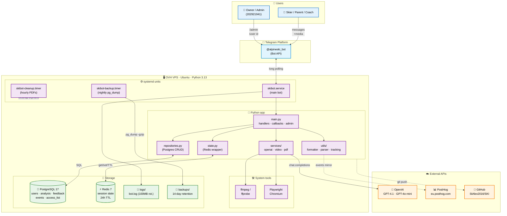
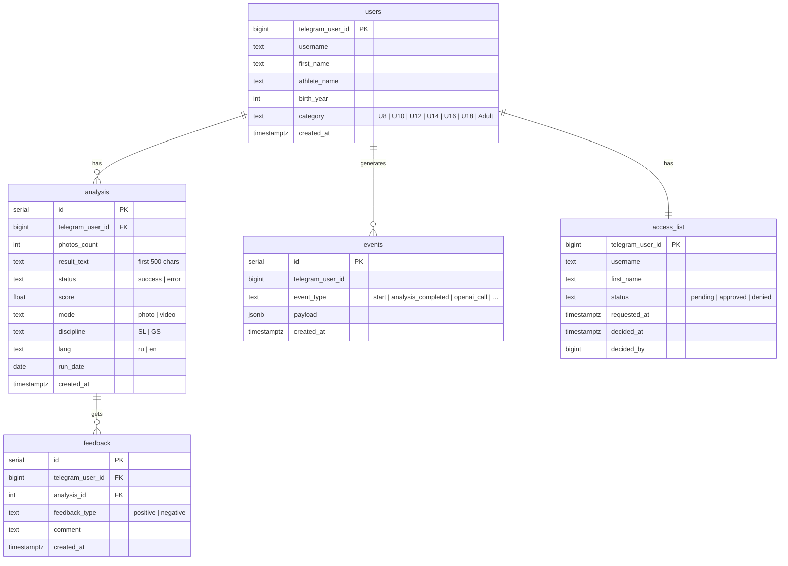
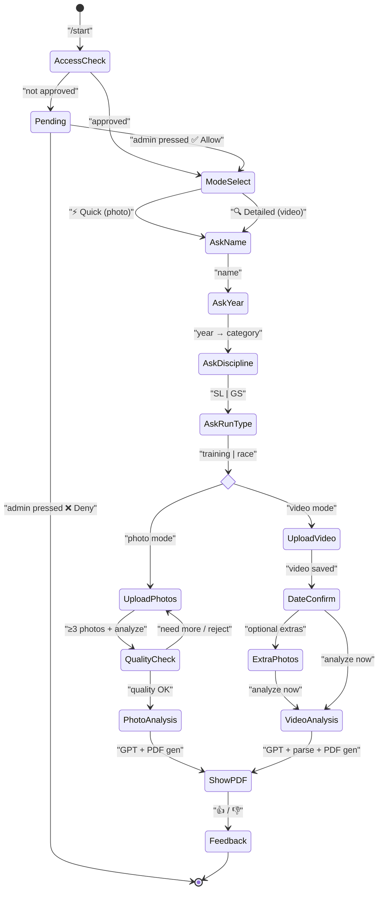

# Alpine Ski Performance Lab — Architecture

Визуальная схема проекта. Mermaid-диаграммы рендерятся прямо в GitHub.

---

## 1. High-level architecture

Кто с кем разговаривает: юзер → Telegram → VPS → внешние API → хранилища.

---

## 2. Data model (PostgreSQL)

---

## 3. User flow (state machine)

От первого контакта до feedback.

---

## 4. Event types tracked

Вся наблюдаемость строится на таблице `events` (+ зеркалится в PostHog).

| Event | When fired | Key payload |
|-------|-----------|-------------|
| `start` | /start | `lang`, `username` |
| `access_requested` | new user hits bot | `username`, `first_name` |
| `user_approved` / `user_denied` | admin action | `target`, `via` |
| `mode_selected` | [Quick] / [Detailed] click | `mode` |
| `discipline_selected` | SL / GS | `discipline` |
| `run_type_selected` | training / race | `run_type` |
| `photo_uploaded` | per photo | `total`, `approved`, `new` |
| `video_uploaded` | per video | `size_bytes` |
| `run_date_detected` | ffprobe result | `run_date`, `source` |
| `run_date_changed` | user picked date | `run_date`, `source`, `days_ago` |
| `analysis_started` | GPT call begins | `mode`, `discipline`, `run_type` |
| `analysis_completed` | PDF sent | `mode`, `duration_sec`, `score` |
| `openai_call` | every GPT call | `model`, `tokens`, `cost_usd`, `latency_sec`, `purpose` |
| `feedback` | 👍 / 👎 | `type`, `analysis_id` |
| `error` | exception in handler | `where`, `message` |

---

## 5. Schedule / automation

```mermaid
gantt
    title Daily cadence (all MSK)
    dateFormat HH:mm
    axisFormat %H:%M

    section Bot
    Running (long-polling)    :active, 00:00, 24h

    section Automated reports
    Daily report → Owner      :milestone, 09:00, 0h
    Weekly report (Mon) → Owner :milestone, 09:05, 0h

    section Maintenance
    Hourly PDF cleanup        :10:00, 1h
    Hourly PDF cleanup        :11:00, 1h
    Hourly PDF cleanup        :12:00, 1h
    Nightly pg_dump           :03:00, 5m
```

---

## 6. Quick facts

- **Language:** Python 3.13
- **Framework:** python-telegram-bot 21.10
- **LLM:** OpenAI GPT-4.1 (video) · GPT-4.1-mini (frame selection) · GPT-4o-mini (photo)
- **PDF render:** Playwright + Chromium (headless)
- **Video frames:** ffmpeg @ 3 fps
- **Session store:** Redis 7 (24h TTL)
- **DB:** PostgreSQL 17 (5 tables)
- **Analytics:** self-hosted via `events` table + mirror to PostHog
- **Backups:** nightly pg_dump, 14-day retention
- **Logs:** RotatingFileHandler 10MB × 10 = 100MB
- **CI/CD:** none yet (manual `git push` + `systemctl restart`)
- **Hosting:** OVH VPS, Ubuntu
- **Owner access:** `/admin` inline panel + slash commands `/stats /user /allow /deny /pending`

---

## 7. What's not here yet

- 🚧 Landing page (domain + static site)
- 🚧 Payment processor (Telegram Stars / ЮKassa)
- 🚧 History / progress tracking in bot UI
- 🚧 Multi-athlete profiles (1 user = 1 athlete for now)
- 🚧 Subscription tiers (pay-per-use + season + annual)
- 🚧 Referral program
- 🚧 Tests, CI/CD, staging environment

See [product roadmap in conversation] for priority.
